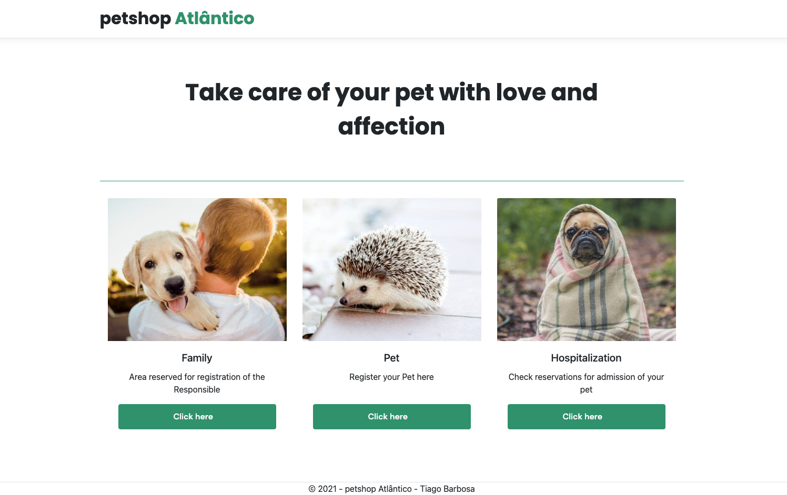

# :cat: Petshop Atlântico :dog: 
***



### :rocket: Tecnologias
***
Este projeto foi desenvolvido com as seguintes tecnologias:
- C#
- .Net Core 5
- Entity Framework
- HTML
- CSS
- Razor

### :computer: Projeto
***
A criação deste projeto teve o objetivo de estudos e colocar a mão na massa. Aplicando boas práticas e funcionalidades da linguagem .Net.

### :bookmark: Layout
***
O layout da aplicação é uma criação própria, tentei focar na usabilidade, sendo o mais objetivo e "clean" que pude.

### :desktop_computer: Como utilizar
***
#### Etapas para realizar o teste

- Faça a clonagem deste repositório
- Abra a IDE que achar mais confortável para edição do código (Visual Studio, VS Code, RIDER etc).
- No terminal integrado da IDE verifique se está com o SDK do .Net instalado usando o comando abaixo:
  ```C#
  dotnet --version
  ```
- Se o comando retornar algum resultado como **dotnet v5.#.#** poderemos continuar o processo de testes, caso dê algum erro, recomendo que baixe o SDK do .Net neste link https://dotnet.microsoft.com/download
- Com o dotnet SDK instalado, novamente no Terminal integrado insira o código abaixo para ativar a API:
  ```C#
  dotnet watch run
  ```
- Aguarde enquanto a CLI do DotNet finalizar as devidas validações
- Após finalizar o sistema abrirá em seu navegador de internet padrão o site (aprecie com moderação)
- Os cards estão disponíveis na ordem em que tem que ser cadastrados:
  - Dono(1) ===> (n)Pet/Pets(1) ===> (1)Internação
  - Escolhi está modelagem da aplicação para que as informações fiquem mais consistentes

### :beers: Considerações finais
***
Este de longe é um projeto "complicado", porém, exigiu uma boa atenção em certas ocasiões, tanto no desenvolvimento do Frontend (com razor pages), quanto no Backend.

Foi um bom desafio, que me ajudou a revisar e reforçar alguns bons conhecimentos.

Espero que gostem!! :vulcan_salute: :grin:
